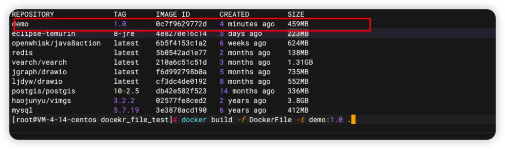

# 五、DockerFile实战

&#x20;       我会使用一个jdk基础的镜像，将自己创建的helloworld.jar 文件构建一个镜像。在启动容器时映射端口。容器后访问服务，服务会获取配置的环境变量返回给我

## 准备的JAR <a href="#tfifb" id="tfifb"></a>

只有两个接口，第一个接口可以获取配置文件中定义的值，第二个接口可以获取系统中指定的环境变量值。

1. Controller

```java
@RestController
@RequestMapping
public class DemoController {

    @Value("${applicationName}")
    private String applicationName;

    @GetMapping("test1")
    public String getApplicationName() {
        return applicationName;
    }

    @GetMapping("env")
    public String getEnv(String envKey) {
        String property = System.getProperty(envKey);
        if (property == null) {
            return "未查询到环境变量";
        }
        return property;
    }
}
```

2. application.yml

```yaml
applicationName: "dockerFile测试"
```

[📎docker\_file\_demo-0.0.1.jar](https://www.yuque.com/attachments/yuque/0/2023/jar/1541192/1699338238736-b17592be-ffdb-4ad5-82f2-52bae7ce5cb8.jar)

## DockerFile <a href="#sfwqs" id="sfwqs"></a>

```docker
FROM fabletang/jre8-alpine

# 设定时区、中文
ENV TZ=Asia/Shanghai
RUN ln -snf /usr/share/zoneinfo/$TZ /etc/localtime && echo $TZ > /etc/timezone \
&& apt-get update && apt-get install -y locales && locale-gen zh_CN.UTF-8 \
&& update-locale LANG=zh_CN.UTF-8 && rm -rf /var/lib/apt/lists/*
ENV LANG=zh_CN.UTF-8 \
    LANGUAGE=zh_CN:zh \
    LC_ALL=zh_CN.UTF-8

# 工作目录
WORKDIR /AppService

# 定义一个环境变量，后面看看通过java服务能否获取到
ENV TEST=测试


# 复制jar到工作目录中
COPY docker_file_demo-0.0.1.jar ./docker_file_demo_1.0.jar


CMD ["java", "-jar", "./docker_file_demo_1.0.jar"]
```

## 构建镜像 <a href="#kp52w" id="kp52w"></a>

```bash
docker build -f DockerFile -t demo:1.0 .
```

* -f: 指定dockerFile文件
* -t: 构建镜像的名称和标签
* . : 表示当前目录（默认）

<figure><figcaption></figcaption></figure>

## 启动RUN <a href="#aegu3" id="aegu3"></a>

```bash
 docker run -p 18080:8080 --name demo -d  demo:1.0 
```

## 映射外部配置文件 <a href="#y1shi" id="y1shi"></a>

1. 修改dockerFile文件，修改CMD指令

```bash
CMD ["java", "-jar", "./docker_file_demo_1.0.jar","--spring.profiles.active=test"]
```

2. 首先看一下配置文件中的内容

```yaml
applicationName: 你获取的是外部的配置文件
```

2. 通过访问 **ip:端口/test1** 获取配置文件中的内容，来判断是否使用的是外部的配置文件
3. 创建容器并制定外部配置文件

```bash
docker run -d --name demo1.7 
-p 18080:8080 
-v /AppService/docker/docker_file/docekr_file_test/application-test.yml:/AppService/application-test.yml demo:1.7
```

4. 验证结果（验证成功）

```bash
[root@VM-4-14-centos docekr_file_test]# curl 127.0.0.1:18080/test1
你获取的是外部的配置文件
[root@VM-4-14-centos docekr_file_test]# 
```
